# How to create a framework for iOS

In the last tutorial I wrote you learnt how to create a reusable knob control,
but it wasn't very clear exactly how you should reuse it. The simplest technique
is to provide the source code files for developers to drop into their Xcode
projects, but 

WRITE THIS LATER

## Getting Started

The main purpose of this tutorial is to explain how to create a framework which
can be used in iOS, and therefore there will only be a small amount of objective-C
code described in the tutorial. In order to get started you should download the
source files for the `RWKnobControl` available in the zip file here. You'll see
how to use them as you go through the process of creating the first project in
the section __Creating a Static Library Project__.

## What is a Framework?

A framework collects a static library and the header files associated with it
together in a well-defined structure in such a way that Xcode understands how
to find the constituent parts. On OSX it is possible to create a dynamically
linked framework - i.e. one which is shared between multiple applications and is
linked at runtime. On iOS dynamically linked frameworks are not allowed - other
than the system ones provided by Apple. There are a few reasons behind this -
principally that apps on iOS are not allowed to share code - i.e. exactly the
purpose of dynamically linked frameworks. However, this doesn't mean that 
frameworks are completely off the table - statically linked frameworks can be
of great use - collecting the static library with the the header files required.

Since this is actually what a framework is comprised of, you're first going to
learn how to create and use a static library, so that when the tutorial moves on
to building a framework then it doesn't come across as smoke and mirrors magic.

## Creating a Static Library project

Open Xcode and create a new static library project by clicking __File > New > Project__
and selecting __iOS > Framework & Library > Cocoa Touch Static Library__.

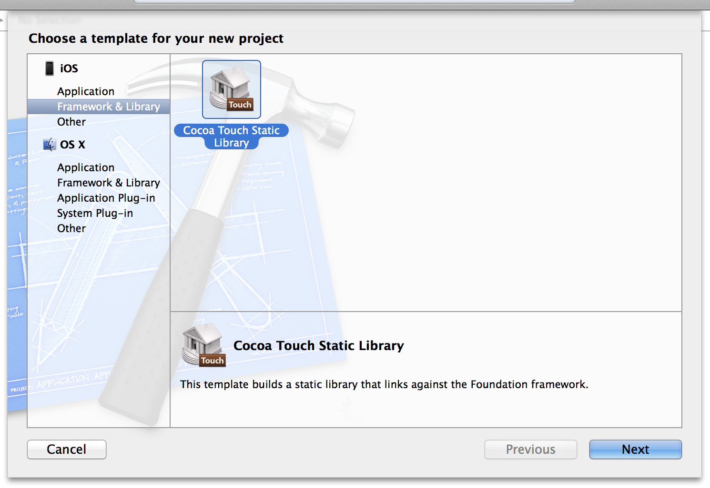

Name the product `RWUIControls` and save the project in an empty directory.

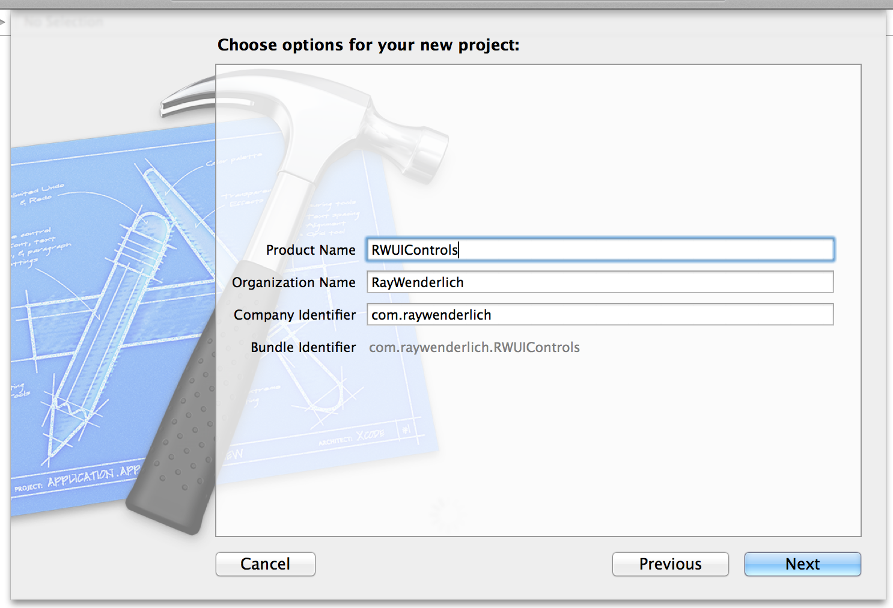

A static library project is made up of header files and `.m` files, which are
compiled to make the library itself.

To make life easier for developers using your library (and later framework) you're 
going to make it so that the only need to import one header file in order to access
all the classes you wish to be available to them. When creating the static
library, Xcode created __RWUIControls.h__ and __RWUIControls.m__ - you don't
need the implementation file, so right click on __RWUIControls.m__ and select
delete. You don't need the file, so move it to the trash when asked. Open up
__RWUIControls.h__ and replace the content with the following:

    #import <UIKit/UIKit.h>

This represents an import which the entire library needs, and as you create the
different component classes you'll add them to this file, ensuring that they
become accessible for users.

Because the project you're building today relies on __UIKit__, and the static
library project doesn't link against it by default, add this as a dependency.
Select the project in the navigator, and then choose the __RWUIControls__
target in then central pane. Click on __Build Phases__ and then expand the
__Link Binary with Libraries__ section. Click the __+__ to add a new framework
and navigate to find __UIKit__ before clicking add.

INSERT GIF HERE

A static library is of no use unless it is combined with a selection of header
files which can be used by the compiler as a manifest of what classes (and
methods on those classes) exist within the binary. Some of the classes you
create in your library will be publicly accessible, but some will be for
internal use only. Next you need to add an operation in the build which will
collect together the public header files and put them somewhere accessible.
Later, these will be copied into the framework.

Whilst still looking at the same __Build Phases__ screen in Xcode as before,
find __Editor > Add Build Phase > Add Copy Headers Build Phase__.

Note: If this option is grayed out in the menu, then try clicking in the white
area below the existing build phases to get the correct focus.

INSERT GIF HERE

You can now add the __RWUIControls.h__ file to the public section of this new
build phase by dragging it from the navigator to the public part of the panel.
This will ensure that this header file is available for users of your library.

Note: All the header files that are included in any of your public headers must
also be made public. Otherwise you'll get compiler errors whilst attempting to
use the library.

### Creating a UI Control

Now that you've got your project set up, it's time to start adding some
functionality to your library - otherwise why would anybody want to use it?
Since the point of this tutorial is to describe how to build a framework, not
how to build a UI control, we'll borrow the code from the last tutorial. In the
zip file you downloaded there is a directory __RWKnobControl__. Drag it from the
finder into the __RWUIControls__ group in Xcode.

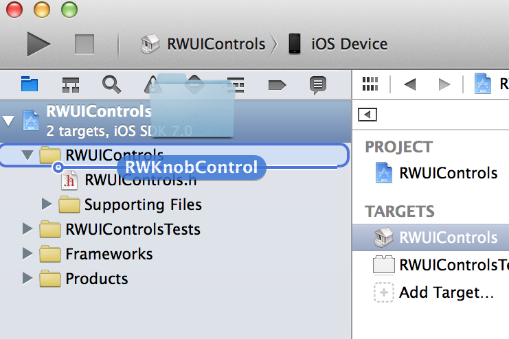

Choose to __Copy items into destination group's folder__ and ensure that the
new files are being added to the __RWUIControls__ static library target.

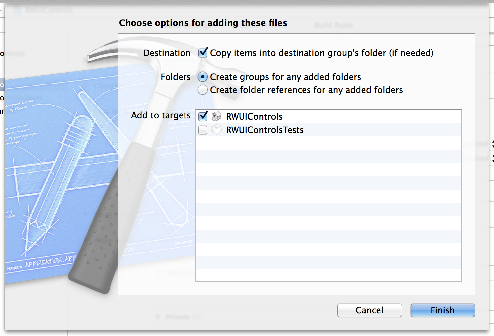

This will add the `.m` files to the compilation list and, by default, the `.h`
files to the __Project__ group. This means that they will not be shared - i.e.
private.

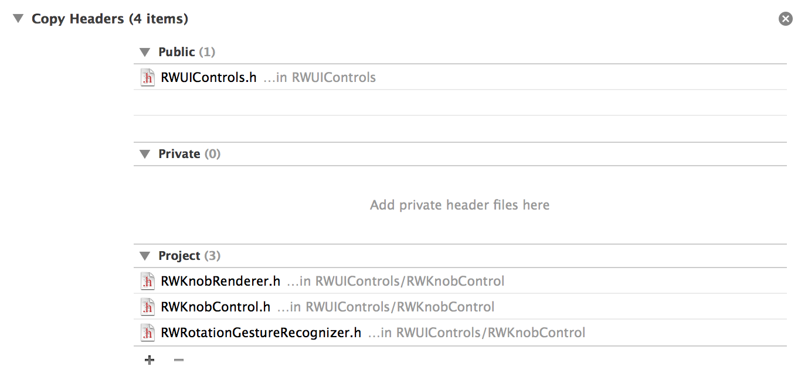

Note: The 3 target names are somewhat confusing: _public_ is shared as expected,
but _private_ is not quite the same as _project_. _Private_ headers can be shared as
private headers - not exactly what you want. Therefore, your headers should
either be in the _public_ group (shared) or the _project_ group (not-shared).

You want to share the main control header - __RWKnobControl.h__, and there are
several ways you can do this. The first is to simply drag the file from the
_project_ group to the _public_ group in the __Copy Headers__ panel.

INSERT_GIF_HERE

Alternatively, you might find it easier to change the membership in the
__Target Membership__ panel when editing the file. This is likely to be more
convenient as you continue to add and develop the library.

Note: as you continue to add new classes to your library, don't forget to keep
the membership up-to-date. Make as few headers public as possible, and ensure
that the remainder are in the _project_ group.

The other thing that you need to do with your control's header file is add it
to the library's main header file - __RWUIControls.h__. This means that a
developer using your library just needs to include one file, and doesn't have
to work out exactly which pieces she needs:

    #import <RWUIControls/RWUIControls.h>

Therefore, add the following to __RWUIControls.h__:

    // Knob Control
    #import <RWUIControls/RWKnobControl.h>

### Configuring Build Settings

You are now very close to being able to build this project and create your
first ever static library, however, there are a few settings that you need to
configure in order to make the library as user-friendly as possible.

Firstly you need to provide a directory name for the public headers to be
copied to. This will ensure that you can locate the relevant headers when you
come to use the static library.

Click on the project in the Project Navigator, and then select the
__RWUIControls__ static library target. Select the __Build Settings__ tab and
then search for __"public headers"__. Double click on the __Public Headers
Folder Path__ and enter the following:

    include/$(PROJECT_NAME)

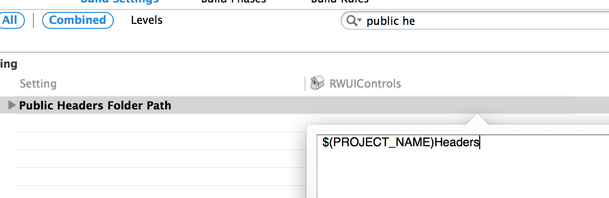

You'll see this directory later on.

The other settings you need to change are related to what gets left in the
binary library. The compiler gives you the option of removing code which is
never accessed (dead code) and also to remove debug symbols (i.e. function
names and other details used in debugging). Since you're creating a framework
for others to use you can disable both of these kinds of stripping, and let the
user choose when they build their dependent app. To do this, use the same
search field again, this time to update the following settings:

- "Dead Code Stripping". Set this to `NO`
- "Strip Debug Symbols During Copy". Set this to `NO` for all configs
- "Strip Style". Set this to `Non-Global Symbols`

It has been a while coming, but you can now build the project. Unfortunately
there isn't a lot to see yet, but at least you can confirm it builds.

To build, select the target as __iOS Device__ and press __⌘ + B__ to perform
the build. Once this has completed then the __libRWUIControls.a__ product in the
__Products__ group of the Project Navigator will turn from red to black,
signaling that it now exists. Right click on __libRWUIControls.a__ and select
__Show in Finder__.

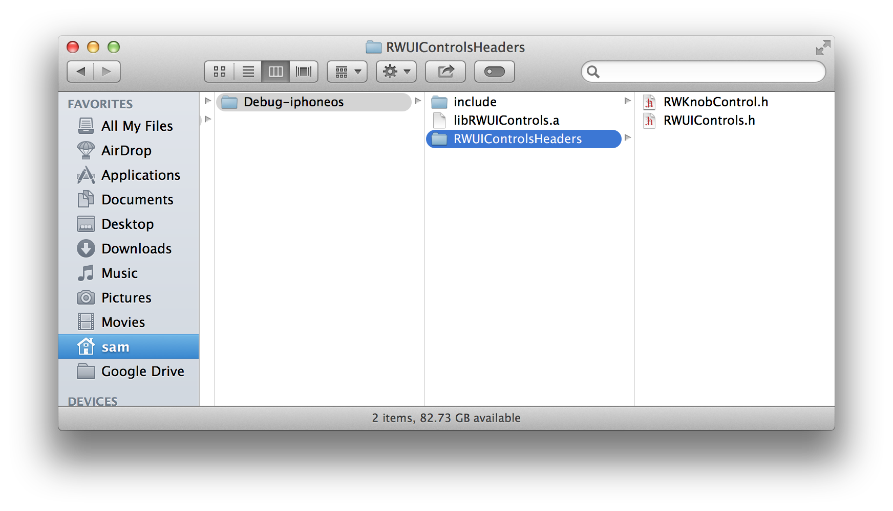

In this directory you can see the static library itself (__libRWUIControls.a__)
and the directory you specified for the public headers - __include/RWUIControls__.
Notice that the headers you made public exist in the folder as you would expect
them to.

### Creating a dependent development project

Developing a UI Controls library for iOS would be extremely difficult if you
couldn't actually see what you were doing - which seems to be the case at the
moment. Therefore, in this section you're going to create a new Xcode project,
which will have a dependency on the library project, allowing you to develop
the framework with a dev app. Crucially, the code for the dev app will be
completely separate from the library itself, which makes for a lot cleaner
structure.

Begin by closing the static library project by clicking __File > Close
Project__. Then create a new project with __File > New > Project__. Select
__iOS > Application > Single View Application__, call the new project
__UIControlDevApp__ and specify that it should be __iPhone__ only. Save the
project in the same directory as you chose for __RWUIControls__.

To add a dependency on the __RWUIControls__ library, drag
__RWUIControls.xcodeproj__ from the Finder into the __UIControlDevApp__ group
in Xcode.

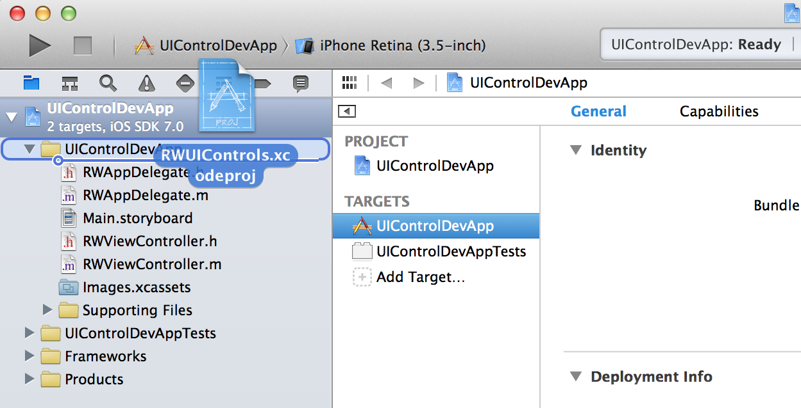

You can now navigate around the library project, inside the dev app project.
This is perfect because it means that you can edit code inside the library and
run up the dev app to check the changes.

Note: You can't have the same project open in 2 different Xcode windows -
therefore, if you're unable to navigate the library project check that you
don't have it open elsewhere.

Rather than recreate the dev app from the last tutorial, you can copy the same
code in. First of all, select __Main.storyboard__, __RWViewController.h__ and
__RWViewController.m__ and delete them by right clicking and selecting
__Delete__. Then copy the the __DevApp__ folder from the zip you downloaded
right into the __UIControlDevApp__ group in Xcode.

INSERT_GIF_HERE

To add a build dependency for the dev app on the static library, select the
__UIControlDevApp__ project in the Project Navigator, and navigate to the
__Build Phases__ tab of the __UIControlDevApp__ target. In the Project
Navigator, navigate to the __Products__ group of the __RWUIControls__ project,
and then drag __libRWUIControls.a__ from the Project Navigator into the __Link
Binary With Libraries__ panel.

INSERT_GIF_HERE

Now you can finally build and run an app and see it in action. If you followed
the previous tutorial on building a knob control, then you'll recognize the
simple app that you've built.

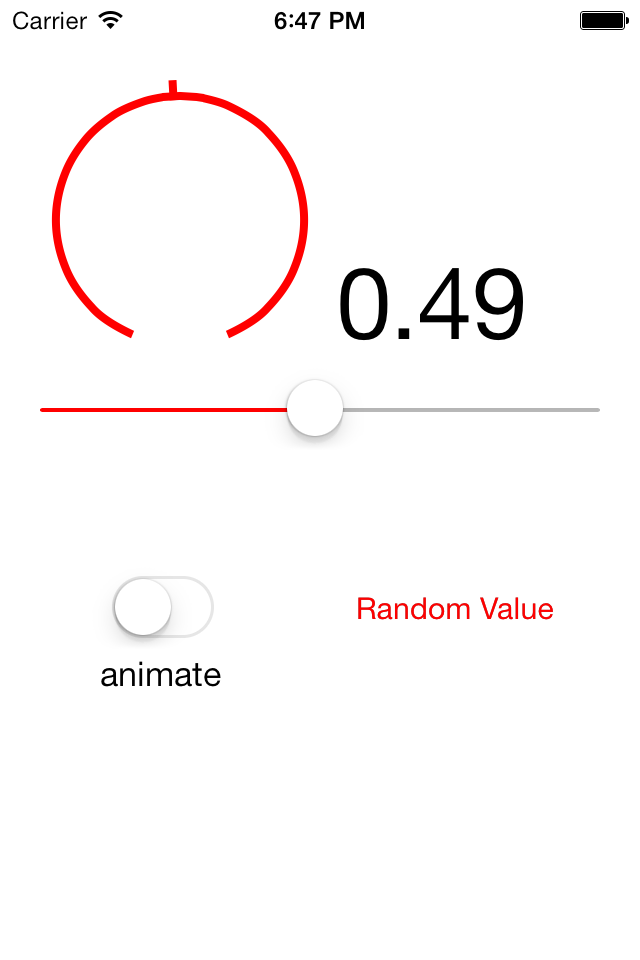

The beauty of using these nested projects like this is that you can continue to
work on the library itself, without leaving the dev app project - whilst
maintaining the code in different places. Each time you build the project
you're also checking that you've got the public/project header membership set
correctly, since the dev app will be unable to build if it is missing required
headers.

## Building a Framework

You would be excused for thinking that when you started this tutorial you were
promised a framework, and so far you've done a lot of work and there is no
framework in sight. Well, this section will change that. The reason that you've
got this far without doing anything towards creating a framework is that a
framework is pretty much a static library and a collection of headers - exactly
what you've built so far. There are a couple of things which make a framework
special:

1. The directory structure. Frameworks have a special directory structure which
is recognized by Xcode. You will create a build task which will create this
structure.
2. The 'slices' in the static library. Currently, when the library is built, it
is only built for the currently required architecture (i.e. i386, arm7 etc). In
order for a framework to be useful it needs to include builds for all the
architectures it needs to run on. You will create a new build product which
will build the required architectures and place them in the framework.

There is a quite a lot of scripting magic in this section, but bear with it -
it's not nearly as complicated as it looks.

### Framework Structure

As mentioned previously, a framework has a special directory structure which
looks like this:

IMAGE OF FRAMEWORK DIRECTORY STRUCTURE

To create this, you need to add a script which will create this as part of the
static library build process. Select the __RWUIControls__ project in the
Project Navigator, and select the __RWUIControls__ static library target.
Choose the __Build Phases__ tab and add a new script by selecting __Editor >
Add Build Phase > Add Run Script Build Phase__.

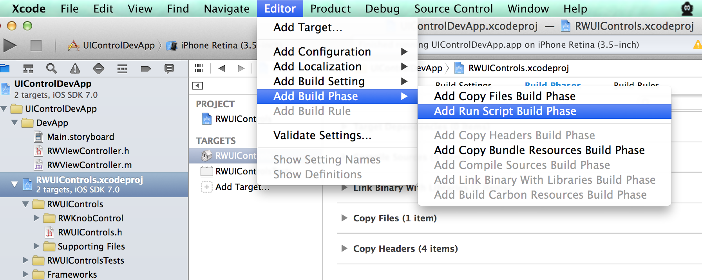

This creates a new panel in the build phases, which allows you to run an
arbitrary script at some point during the build. You can change when the script
runs by dragging the panel around in the list; for the framework project you
want the script to be run last, so you can leave it where it is placed by
default.

Rename the script by double clicking on the panel title ("Run Script") and
replacing it with "Build Framework".

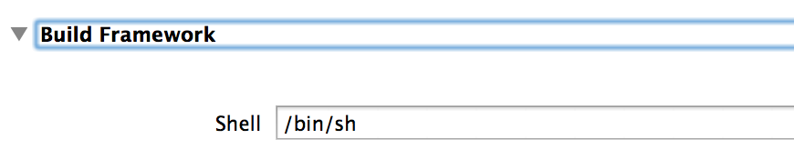

Paste the following script in the script field:

    set -e

    export FRAMEWORK_LOCN="${BUILT_PRODUCTS_DIR}/${PRODUCT_NAME}.framework"

    # Create the path to the real Headers dir
    mkdir -p "${FRAMEWORK_LOCN}/Versions/A/Headers"

    # Create the required symlinks
    /bin/ln -sfh A "${FRAMEWORK_LOCN}/Versions/Current"
    /bin/ln -sfh Versions/Current/Headers "${FRAMEWORK_LOCN}/Headers"
    /bin/ln -sfh "Versions/Current/${PRODUCT_NAME}" \
                 "${FRAMEWORK_LOCN}/${PRODUCT_NAME}"

    # Copy the public headers into the framework
    /bin/cp -a "${TARGET_BUILD_DIR}/${PUBLIC_HEADERS_FOLDER_PATH}/" \
               "${FRAMEWORK_LOCN}/Versions/A/Headers"

This script first creates the __RWUIControls.framework/Versions/A/Headers__
directory before then creating the 3 symlinks required for a framework:

- __Versions/Current__ => __A__
- __Headers__ => __Versions/Current/Headers__
- __RWUIControls__ => __Versions/Current/RWUIControls__

Finally, the public header files are copied into the __Versions/A/Headers__
directory from the public headers path you specified before. The __-a__
argument ensures that the modified times are not changed as part of the copy,
thereby preventing unnecessary rebuilds.

Select the __RWUIControls__ static library scheme, and __iOS Device__ build
target and build using __⌘ + B__.

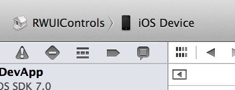

Right click on the __libRWUIControls.a__ static library in the __Products__
group of the __RWUIControls__ project, and select __Show In Finder__.

Within this build directory you can see the __RWUIControls.framework__, and you
can confirm that the correct directory structure has been created and
populated:

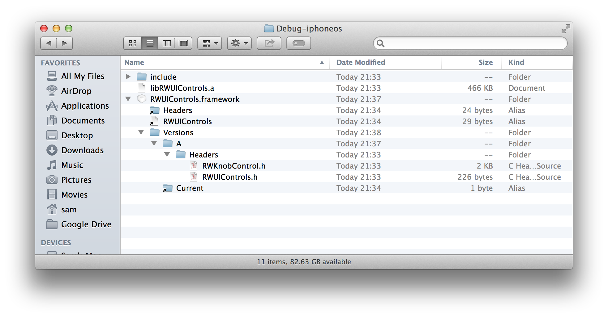

This is step along the path to completing a framework, but you'll notice that
there there isn't a static lib in there yet - that's what you're going to sort
next.

### Multi-architecture Build

iOS apps need to run on a lot of different architectures:

- __arm7__ Used in the oldest iOS7-supporting devices
- __arm7s__ As used in iPhone 5 and 5C
- __arm64__ For the 64-bit ARM processor in iPhone 5S
- __i386__ For the 32-bit simulator
- __x86_64__ Used in 64-bit simulator

Each architecture requires a different binary, and when you build an app Xcode
will build the correct architecture for whatever you're currently doing - i.e.
if you've asked to run in the simulator then it'll only build the i386 version
(or x86_64 for 64-bit). This means that builds are as fast as they can be. When
you archive an app (or build in release mode) in preparation for upload to the
app store, then Xcode will build for all 3 ARM architectures, allowing the app
to be run on all possible devices.

When you build your framework, you want developers using it to be able to use
it for all the possible architectures, and therefore you need to make Xcode
build for all 5 architectures. This process creates a so-called 'fat' binary,
which contains a slice for each of the architectures.

Note: This actually highlights another reason for using a dev app which has a
dependency on the static library: the library will only be built for the
architecture currently required for the dev app, and will actually only be
rebuilt if something has changed. This means the development cycle is as quick
as possible.

The framework will be created using a new target in the __RWUIControls__
project. To create it select the __RWUIControls__ project in the Project
Navigator and then click the __Add Target__ button at the bottom of the
existing targets.

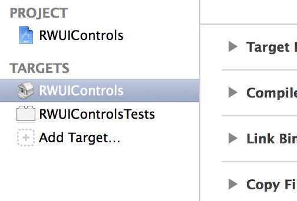

Navigate to __iOS > Other > Aggregate__, click next and name the target
__Framework__.

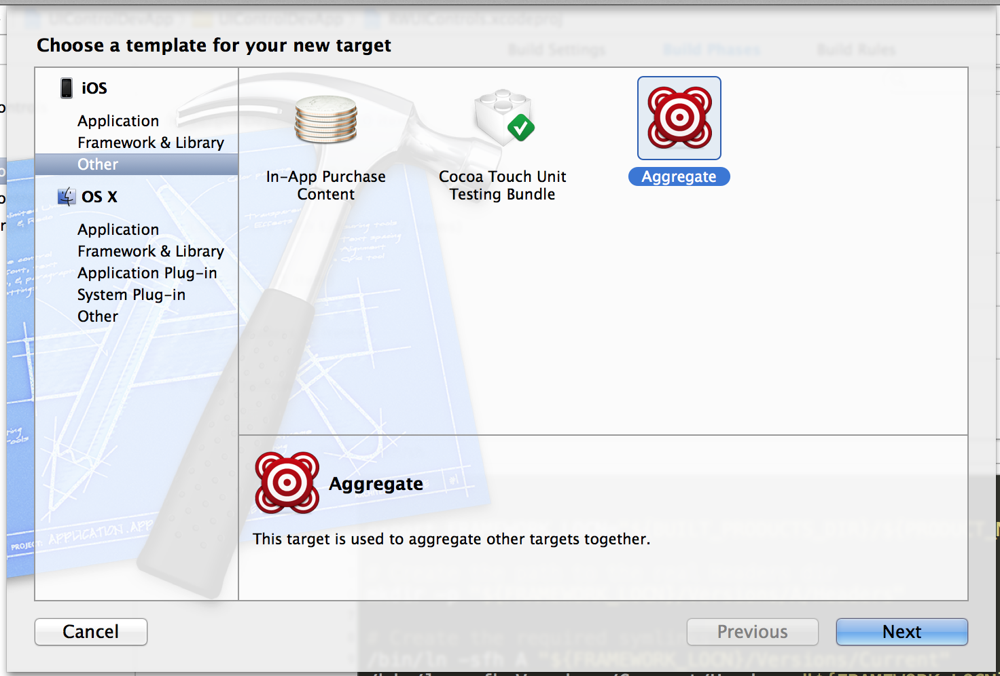

To ensure that when this new framework target is built, the static library is
built as well, then add a dependency on the static library target. Select the
framework target in the library project and add a dependency in the __Build
Phases__ tab.

GIF IN HERE

The main build part of this target is the multi-platform building, which you'll
perform using a script. As you did before, create a new "Run Script" build
phase by selecting the __Build Phases__ tab of the __Framework__ target, and
clicking __Editor > Add Build Phase > Add Run Script Build Phase__.

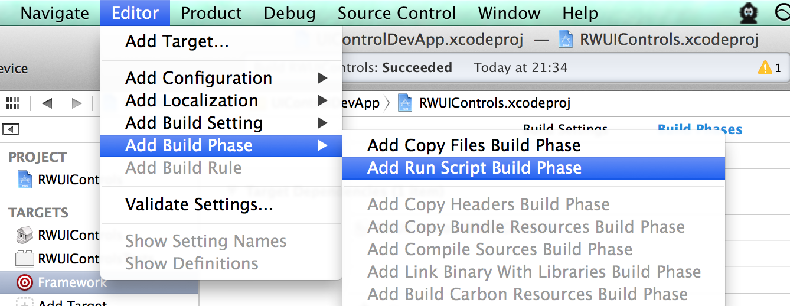

Change the name of the script as before by double clicking on __Run Script__ -
call it __MultiPlatform Build__.

## How to use a framework

## Using a bundle for resources

### Importing the bundle into the dependent project

## Where To Go From Here?

